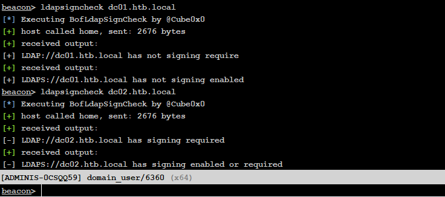
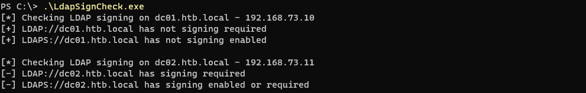

# LdapSignCheck

Beacon Object File to scan a Domain Controller to see if LdapEnforceChannelBinding or LdapServerIntegrity has been modified to mitigate against relaying attacks. 

(Having LDAPS channel binding set to Enabled is enough to prevent most relaying attacks based on my testing)

C# Version

